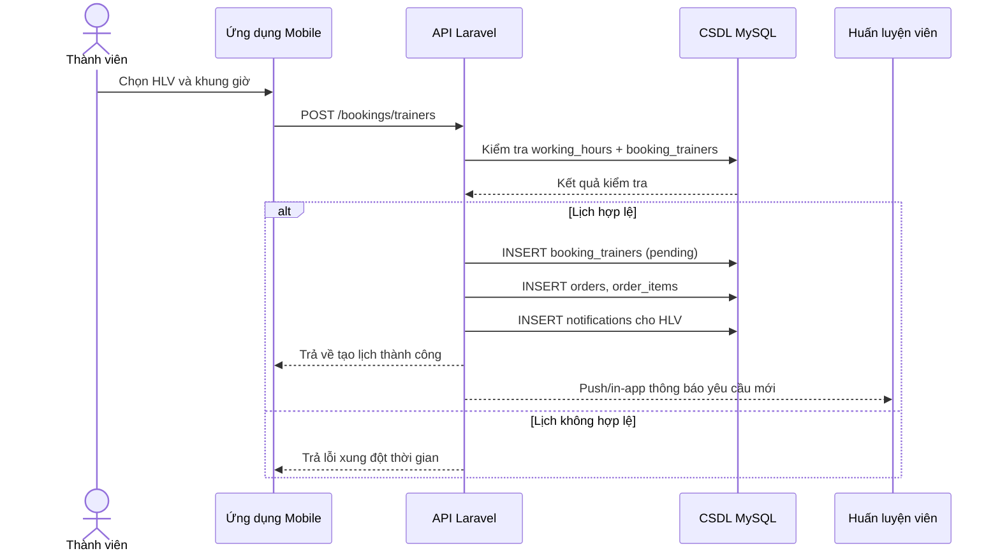
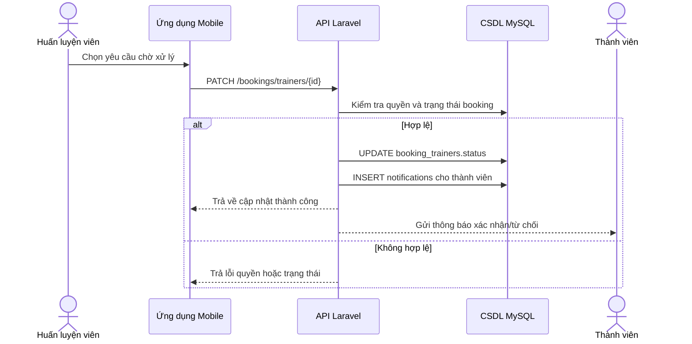
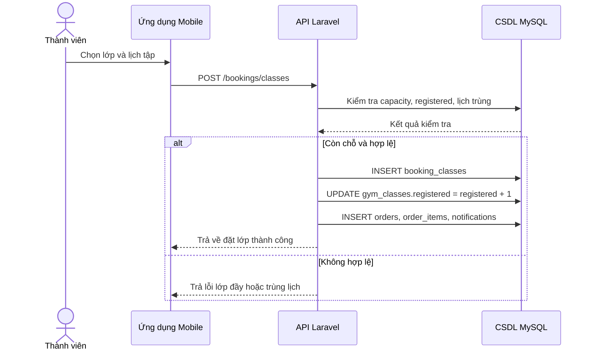
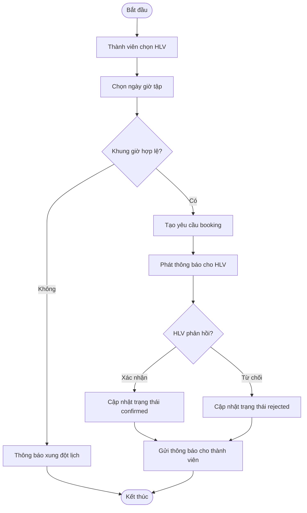
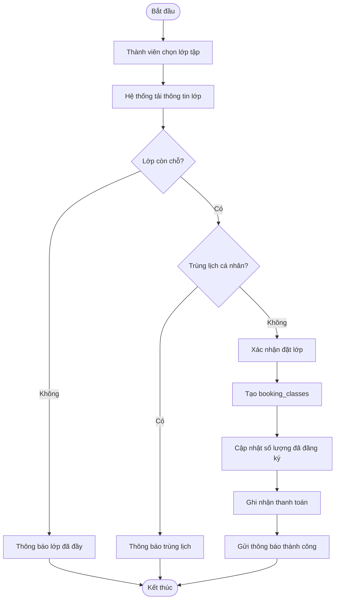
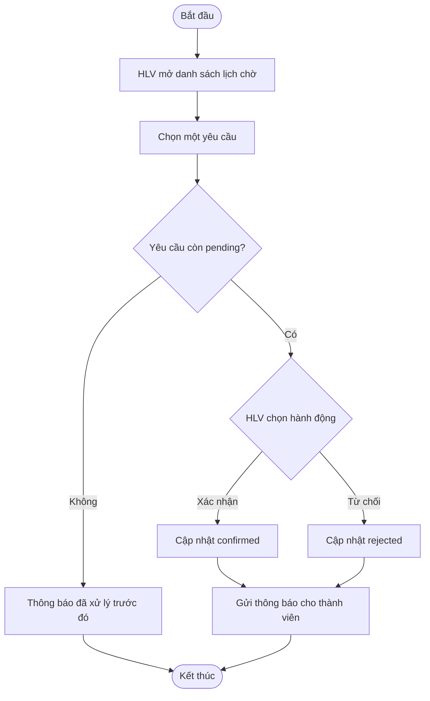

# CHƯƠNG 3. THIẾT KẾ HỆ THỐNG

Chương này trình bày thiết kế của hệ thống quản lý phòng gym theo ba góc nhìn chính: mô hình dữ liệu, mô hình xử lý và hệ thống giao diện - báo biểu. Các nội dung được xây dựng bám sát các chức năng đang có trong hệ thống gồm: quản lý thành viên, huấn luyện viên, lớp tập, đặt lịch, thanh toán, thông báo, báo cáo và các tiện ích dành cho quản trị viên/huấn luyện viên/thành viên.

## 3.1. Mô hình dữ liệu

### 3.1.1. Mô hình dữ liệu mức ý niệm

Ở mức ý niệm, hệ thống được tổ chức xung quanh các thực thể nghiệp vụ chính sau:

| Thực thể | Ý nghĩa |
|---|---|
| Người dùng (User) | Lưu thông tin tài khoản đăng nhập của thành viên, huấn luyện viên và quản trị viên |
| Thành viên (Member) | Thông tin mở rộng của người dùng là thành viên phòng gym |
| Huấn luyện viên (Trainer) | Thông tin mở rộng của người dùng là huấn luyện viên |
| Lớp tập (Gym Class) | Danh mục các lớp tập có lịch, địa điểm, giá và sức chứa |
| Gói tập (Package) | Gói thành viên theo thời hạn và quyền lợi |
| Đơn hàng (Order) | Ghi nhận giao dịch thanh toán |
| Chi tiết đơn hàng (Order Item) | Lưu từng dịch vụ được thanh toán trong đơn |
| Đặt lớp (Booking Class) | Ghi nhận đăng ký lớp tập của thành viên |
| Đặt HLV (Booking Trainer) | Ghi nhận yêu cầu thuê huấn luyện viên |
| Lịch làm việc (Working Hour, Schedule) | Xác định khung giờ làm việc và lịch tập |
| Nghỉ phép (Time Off) | Yêu cầu nghỉ của huấn luyện viên |
| Ghi chú buổi tập (Session Note) | Ghi chú sau mỗi buổi tập |
| Kế hoạch tập luyện (Workout Plan) | Giáo án tập luyện do huấn luyện viên tạo |
| Doanh thu HLV (Trainer Earning) | Theo dõi thu nhập và số dư rút tiền |
| Yêu cầu rút tiền (Withdrawal Request) | HLV gửi yêu cầu rút tiền |
| Hoàn tiền (Refund Request) | Yêu cầu hoàn tiền cho các giao dịch |
| Giao dịch (Transaction Report) | Báo cáo giao dịch tài chính |
| Voucher / Campaign / Notification | Các thực thể hỗ trợ marketing và thông báo |

Quan hệ tổng quát giữa các thực thể có thể mô tả như sau:

- Một người dùng có thể có một hồ sơ thành viên hoặc một hồ sơ huấn luyện viên.
- Một thành viên có thể đặt nhiều lớp tập, đặt nhiều lịch thuê HLV và có nhiều giao dịch thanh toán.
- Một huấn luyện viên có thể có nhiều khung giờ làm việc, nhiều yêu cầu nghỉ phép, nhiều buổi đặt lịch và nhiều kế hoạch tập luyện.
- Một đơn hàng có thể bao gồm nhiều chi tiết đơn hàng.
- Một yêu cầu hoàn tiền hoặc rút tiền đều gắn với một đối tượng nghiệp vụ cụ thể và được quản trị viên phê duyệt.

### 3.1.2. Mô hình dữ liệu mức luận lý

Mức luận lý của hệ thống được biểu diễn dưới dạng các bảng quan hệ trong cơ sở dữ liệu MySQL. Các bảng chính và khóa dữ liệu gồm:

| Bảng | Khóa chính | Khóa ngoại / liên kết chính | Thuộc tính tiêu biểu |
|---|---|---|---|
| `users` | `id` | - | `name`, `email`, `phone`, `role`, `password`, `email_verified_at` |
| `trainers` | `id` | `user_id` -> `users.id` | `name`, `email`, `phone`, `spec`, `exp`, `rating`, `availability`, `price` |
| `members` | `id` | `user_id` -> `users.id` | `dob`, `membership_type`, `membership_start`, `membership_end`, `expo_push_token` |
| `gym_classes` | `id` | - | `name`, `trainer_name`, `time`, `duration`, `days`, `location`, `capacity`, `registered`, `price` |
| `packages` | `id` | - | `name`, `duration`, `price`, `old_price`, `benefits`, `benefits_text`, `color`, `is_popular`, `status` |
| `orders` | `id` | `user_id` -> `users.id` | `total_amount`, `payment_method`, `status` |
| `order_items` | `id` | `order_id` -> `orders.id` | `item_id`, `item_name`, `item_type`, `price` |
| `booking_classes` | `id` | `user_id` -> `users.id` | `class_id`, `schedule`, `status` |
| `booking_trainers` | `id` | `user_id`, `trainer_id` | `schedule_info`, `status` |
| `working_hours` | `id` | `trainer_id` -> `trainers.id` | `day_of_week`, `start_time`, `end_time`, `is_active` |
| `time_offs` | `id` | `trainer_id`, `approved_by` | `start_date`, `end_date`, `reason`, `status` |
| `session_notes` | `id` | `booking_id`, `trainer_id`, `member_id` | `note_date`, `content`, `status` |
| `workout_plans` | `id` | `trainer_id`, `member_id` | `title`, `content`, `duration`, `difficulty`, `start_date`, `end_date` |
| `trainer_earnings` | `id` | `trainer_id` -> `trainers.id` | `total_earnings`, `completed_sessions`, `pending_sessions`, `cancelled_sessions`, `withdrawal_balance`, `commission_rate` |
| `withdrawal_requests` | `id` | `trainer_id`, `approved_by` | `amount`, `method`, `status`, `bank_details`, `processed_at` |
| `refund_requests` | `id` | `booking_id`, `member_id`, `approved_by` | `reason`, `requested_amount`, `approved_amount`, `status`, `refund_method`, `notes`, `processed_at` |
| `transaction_reports` | `id` | `member_id`, `trainer_id` | `date`, `type`, `amount`, `description`, `details` |
| `notifications` | `id` | `user_id` | `title`, `message`, `type`, `related_type`, `related_id`, `is_read` |

### 3.1.3. Mô hình dữ liệu mức vật lý

Ở mức vật lý, hệ thống sử dụng cơ sở dữ liệu quan hệ MySQL với các đặc điểm chính:

- Mã hóa ký tự `utf8mb4` để hỗ trợ tiếng Việt và ký tự đặc biệt.
- Đa số bảng sử dụng kiểu `bigint unsigned` cho khóa chính tự tăng.
- Các quan hệ chính được ánh xạ qua cột khóa ngoại như `user_id`, `trainer_id`, `booking_id`, `member_id`.
- Các trường trạng thái được lưu bằng kiểu `varchar` hoặc `enum` để thuận tiện mở rộng nghiệp vụ.
- Các trường tiền tệ sử dụng kiểu `decimal` để đảm bảo độ chính xác.
- Các trường ngày giờ dùng `timestamp`, `date`, `datetime` tùy ngữ cảnh sử dụng.

Việc tổ chức vật lý như trên giúp hệ thống đảm bảo tính nhất quán dữ liệu, thuận tiện truy vấn thống kê và phù hợp với mô hình ứng dụng có nhiều luồng nghiệp vụ đồng thời.

## 3.2. Mô hình xử lý

### 3.2.1. Use case chi tiết (kèm bảng mô tả)

#### a) Danh mục use case nghiệp vụ

| Mã UC | Tên use case | Tác nhân chính | Mức ưu tiên |
|---|---|---|---|
| UC01 | Đăng ký tài khoản | Khách hàng | Cao |
| UC02 | Đăng nhập hệ thống | Thành viên / HLV / Quản trị viên | Cao |
| UC03 | Đặt lớp tập | Thành viên | Cao |
| UC04 | Đặt lịch huấn luyện viên | Thành viên | Cao |
| UC05 | Xác nhận/Từ chối lịch PT | Huấn luyện viên | Cao |
| UC06 | Theo dõi đơn hàng thanh toán | Thành viên / Quản trị viên | Trung bình |
| UC07 | Gửi và nhận thông báo | Hệ thống / Người dùng | Trung bình |
| UC08 | Quản lý lịch làm việc HLV | Huấn luyện viên | Trung bình |
| UC09 | Quản lý doanh thu và rút tiền HLV | Huấn luyện viên / Quản trị viên | Trung bình |
| UC10 | Quản trị dữ liệu lớp tập, gói tập, HLV | Quản trị viên | Cao |

#### b) Đặc tả UC03 - Đặt lớp tập

| Mục | Nội dung |
|---|---|
| Mã use case | UC03 |
| Tên use case | Đặt lớp tập |
| Mục tiêu | Thành viên đăng ký tham gia lớp theo lịch cố định |
| Tác nhân chính | Thành viên |
| Tác nhân liên quan | Hệ thống, Quản trị viên |
| Tiền điều kiện | (1) Đã đăng nhập; (2) Lớp còn chỗ; (3) Lịch không trùng |
| Hậu điều kiện thành công | Tạo bản ghi trong `booking_classes`, cập nhật `registered` của lớp, phát sinh `orders`/`order_items` (nếu có thanh toán), gửi `notifications` |
| Hậu điều kiện thất bại | Không tạo bản ghi đặt lớp, trả thông báo lỗi phù hợp |
| Dữ liệu sử dụng | `gym_classes`, `booking_classes`, `orders`, `order_items`, `notifications` |

| Luồng chính | Mô tả xử lý |
|---|---|
| B1 | Thành viên mở danh sách lớp và chọn lớp cần đăng ký |
| B2 | Hệ thống tải thông tin lịch học, sức chứa, số người đã đăng ký, giá |
| B3 | Thành viên xác nhận lịch muốn đặt |
| B4 | Hệ thống kiểm tra điều kiện hợp lệ (còn chỗ, không trùng lịch) |
| B5 | Hệ thống tạo bản ghi đặt lớp với trạng thái phù hợp |
| B6 | Hệ thống ghi nhận thanh toán và gửi thông báo đặt lớp thành công |

| Luồng ngoại lệ | Mô tả xử lý |
|---|---|
| E1 | Lớp đầy chỗ: hệ thống từ chối đặt và yêu cầu chọn lớp/lịch khác |
| E2 | Trùng lịch: hệ thống cảnh báo xung đột thời gian |
| E3 | Lỗi thanh toán: giữ trạng thái chờ hoặc hủy theo quy tắc nghiệp vụ |

#### c) Đặc tả UC04 - Đặt lịch huấn luyện viên

| Mục | Nội dung |
|---|---|
| Mã use case | UC04 |
| Tên use case | Đặt lịch huấn luyện viên cá nhân |
| Mục tiêu | Thành viên tạo yêu cầu tập cá nhân với HLV theo khung giờ cụ thể |
| Tác nhân chính | Thành viên |
| Tác nhân liên quan | Huấn luyện viên, Hệ thống |
| Tiền điều kiện | (1) Thành viên đăng nhập; (2) HLV tồn tại; (3) Khung giờ nằm trong lịch làm việc |
| Hậu điều kiện thành công | Tạo bản ghi `booking_trainers` trạng thái `pending/confirmed`, tạo `orders`/`order_items`, gửi thông báo |
| Hậu điều kiện thất bại | Không tạo booking hoặc booking bị từ chối, có thông báo lý do |
| Dữ liệu sử dụng | `trainers`, `working_hours`, `booking_trainers`, `orders`, `order_items`, `notifications` |

| Luồng chính | Mô tả xử lý |
|---|---|
| B1 | Thành viên chọn huấn luyện viên |
| B2 | Hệ thống hiển thị lịch khả dụng từ `working_hours` |
| B3 | Thành viên chọn giờ tập và gửi yêu cầu |
| B4 | Hệ thống kiểm tra xung đột lịch và tính khả dụng |
| B5 | Hệ thống tạo booking, lưu giao dịch và phát thông báo cho HLV |
| B6 | HLV xác nhận, hệ thống cập nhật trạng thái và thông báo cho thành viên |

| Luồng ngoại lệ | Mô tả xử lý |
|---|---|
| E1 | Khung giờ đã được đặt: yêu cầu chọn lại thời gian |
| E2 | HLV từ chối yêu cầu: cập nhật trạng thái `rejected` |
| E3 | HLV không phản hồi trong thời gian quy định: hệ thống tự động hết hạn/yêu cầu đặt lại |

#### d) Đặc tả UC05 - HLV xác nhận/từ chối lịch

| Mục | Nội dung |
|---|---|
| Mã use case | UC05 |
| Tên use case | Xử lý yêu cầu đặt lịch PT |
| Mục tiêu | HLV xử lý các yêu cầu đặt lịch đang chờ |
| Tác nhân chính | Huấn luyện viên |
| Tác nhân liên quan | Thành viên, Hệ thống |
| Tiền điều kiện | Có bản ghi `booking_trainers` trạng thái `pending` thuộc HLV hiện tại |
| Hậu điều kiện thành công | Trạng thái booking chuyển sang `confirmed` hoặc `rejected`; thành viên nhận thông báo |
| Hậu điều kiện thất bại | Không thay đổi trạng thái booking |
| Dữ liệu sử dụng | `booking_trainers`, `notifications`, `trainer_earnings` (khi hoàn thành buổi tập) |

| Luồng chính | Mô tả xử lý |
|---|---|
| B1 | HLV mở danh sách lịch chờ xác nhận |
| B2 | Hệ thống trả về dữ liệu booking theo HLV |
| B3 | HLV chọn xác nhận hoặc từ chối |
| B4 | Hệ thống cập nhật trạng thái booking |
| B5 | Hệ thống tạo thông báo cho thành viên |

| Luồng ngoại lệ | Mô tả xử lý |
|---|---|
| E1 | Booking đã được xử lý trước đó: trả thông báo trạng thái hiện tại |
| E2 | Không đúng quyền HLV: từ chối thao tác |

### 3.2.2. Sơ đồ tuần tự

#### a) Sơ đồ tuần tự UC04 - Đặt lịch huấn luyện viên

#### b) Sơ đồ tuần tự UC05 - HLV xác nhận lịch

#### c) Sơ đồ tuần tự UC03 - Đặt lớp tập

### 3.2.3. Sơ đồ hoạt động (activity)

#### a) Sơ đồ activity UC04 - Đặt lịch huấn luyện viên

#### b) Sơ đồ activity UC03 - Đặt lớp tập

#### c) Sơ đồ activity UC05 - HLV xử lý yêu cầu đặt lịch

## 3.3. Hệ thống màn hình

Thiết kế giao diện của hệ thống được xây dựng theo hướng mobile-first, nhất quán với ứng dụng di động đa vai trò. Trong phạm vi luận văn, giao diện nên được mô tả bằng công cụ thiết kế chuyên dụng như Figma, Adobe XD hoặc công cụ prototype tương đương; không sử dụng bản vẽ tay hay ảnh chụp màn hình thô.

### 3.3.1. Nhóm màn hình dành cho khách hàng / thành viên

| Màn hình | Mục đích | Thành phần chính |
|---|---|---|
| Đăng ký | Tạo tài khoản mới | Họ tên, email, mật khẩu, xác thực email |
| Đăng nhập | Xác thực người dùng | Email, mật khẩu, quên mật khẩu |
| Dashboard | Truy cập nhanh chức năng | Thống kê, lối tắt, thông báo nhanh |
| Danh sách lớp | Xem và chọn lớp tập | Bộ lọc, thẻ lớp, giá, lịch, sức chứa |
| Đặt HLV | Đặt lịch huấn luyện cá nhân | Danh sách HLV, khung giờ, ghi chú |
| Thanh toán | Hoàn tất thanh toán | Giỏ hàng, tổng tiền, phương thức thanh toán |
| Lịch sử | Xem lịch đã đặt | Lịch sử đặt lớp, lịch thuê HLV, phân trang |
| Thông báo | Nhận thông báo hệ thống | Danh sách thông báo, trạng thái đã đọc |
| Hồ sơ cá nhân | Quản lý thông tin tài khoản | Avatar, thông tin cá nhân, đổi mật khẩu |

### 3.3.2. Nhóm màn hình dành cho huấn luyện viên

| Màn hình | Mục đích | Thành phần chính |
|---|---|---|
| Lịch xác nhận | Quản lý lịch chờ | Danh sách yêu cầu, nút xác nhận / từ chối |
| Lịch làm việc | Thiết lập khung giờ | Ca làm việc, trạng thái hoạt động |
| Nghỉ phép | Gửi yêu cầu nghỉ | Ngày bắt đầu, ngày kết thúc, lý do |
| Ghi chú buổi tập | Lưu nội dung buổi học | Nội dung, trạng thái, liên kết booking |
| Kế hoạch tập luyện | Tạo giáo án | Mục tiêu, nội dung, thời lượng, độ khó |
| Doanh thu | Theo dõi thu nhập | Tổng thu nhập, số dư rút, hoa hồng |
| Rút tiền | Gửi yêu cầu rút tiền | Số tiền, phương thức, thông tin ngân hàng |
| Quản lý học viên | Xem khách hàng của HLV | Danh sách học viên, trạng thái check-in |

### 3.3.3. Nhóm màn hình dành cho quản trị viên

| Màn hình | Mục đích | Thành phần chính |
|---|---|---|
| Dashboard quản trị | Điều hành tổng quan | Thống kê lớp, HLV, gói tập, booking |
| Quản lý lớp | CRUD lớp tập | Danh sách lớp, form thêm/sửa, lịch lớp |
| Quản lý HLV | CRUD huấn luyện viên | Thông tin HLV, lịch làm việc, trạng thái |
| Quản lý gói tập | CRUD gói thành viên | Giá, thời hạn, quyền lợi, trạng thái |
| Quản lý thành viên | Quản lý hồ sơ hội viên | Tài khoản, gói, thời hạn, trạng thái |
| Báo cáo | Tổng hợp giao dịch | Giao dịch, hoàn tiền, doanh thu, xuất CSV |
| Hoàn tiền | Duyệt hoàn tiền | Danh sách yêu cầu, phê duyệt, từ chối |
| Chiến dịch marketing | Gửi thông báo hàng loạt | Nội dung, lịch gửi, trạng thái |

### 3.3.4. Định hướng bố cục giao diện

Giao diện được tổ chức theo các nguyên tắc sau:

- Thanh điều hướng rõ ràng theo vai trò người dùng.
- Ưu tiên các khối thông tin dạng thẻ để người dùng thao tác nhanh trên điện thoại.
- Màu sắc phân biệt trạng thái: thành công, chờ duyệt, từ chối, cảnh báo.
- Biểu mẫu nhập liệu rút gọn, hạn chế trường không cần thiết.
- Màn hình báo cáo sử dụng bảng và bộ lọc để phục vụ quản trị.

## 3.4. Hệ thống báo biểu

Hệ thống có triển khai nhóm báo biểu phục vụ quản trị và giám sát hoạt động kinh doanh. Báo biểu không chỉ là trang hiển thị số liệu mà còn hỗ trợ lọc, xuất file và theo dõi tiến trình xử lý.

### 3.4.1. Các báo biểu chính

| Báo biểu | Nội dung | Đối tượng sử dụng |
|---|---|---|
| Báo cáo giao dịch | Danh sách giao dịch thanh toán theo ngày, loại và số tiền | Quản trị viên |
| Báo cáo doanh thu | Tổng doanh thu theo tháng/quý và phân loại nguồn thu | Quản trị viên |
| Báo cáo hoàn tiền | Danh sách yêu cầu hoàn tiền, trạng thái xử lý | Quản trị viên |
| Báo cáo tiền lương HLV | Thu nhập, số buổi hoàn thành, số dư rút tiền | Quản trị viên / HLV |
| Báo cáo hoạt động thành viên | Số lượt đặt lớp, đặt HLV, lịch sử sử dụng | Quản trị viên |
| Báo cáo doanh thu cá nhân | Doanh thu và số buổi của từng HLV | Huấn luyện viên |

### 3.4.2. Đặc điểm của báo biểu

- Có bộ lọc theo khoảng thời gian, trạng thái và loại giao dịch.
- Có chức năng xuất dữ liệu ra tệp phục vụ tổng hợp ngoài hệ thống.
- Hiển thị số liệu tổng hợp ở đầu trang để người quản trị nắm nhanh tình hình.
- Số liệu báo biểu được lấy từ các bảng giao dịch, hoàn tiền, doanh thu HLV và lịch đặt.

### 3.4.3. Ý nghĩa của hệ thống báo biểu

Việc tổ chức báo biểu giúp hệ thống không chỉ dừng lại ở chức năng tác nghiệp mà còn hỗ trợ ra quyết định quản trị. Nhờ các báo cáo tổng hợp, ban quản trị có thể theo dõi doanh thu, kiểm soát hoàn tiền, đánh giá hiệu quả của huấn luyện viên và phân tích mức độ sử dụng dịch vụ của thành viên.

## Kết luận chương

Chương 3 đã trình bày thiết kế tổng thể của hệ thống quản lý phòng gym ở ba mức dữ liệu, đồng thời mô tả các luồng xử lý nghiệp vụ, giao diện màn hình và nhóm báo biểu quan trọng. Đây là cơ sở để triển khai, kiểm thử và hoàn thiện hệ thống ở các chương tiếp theo.